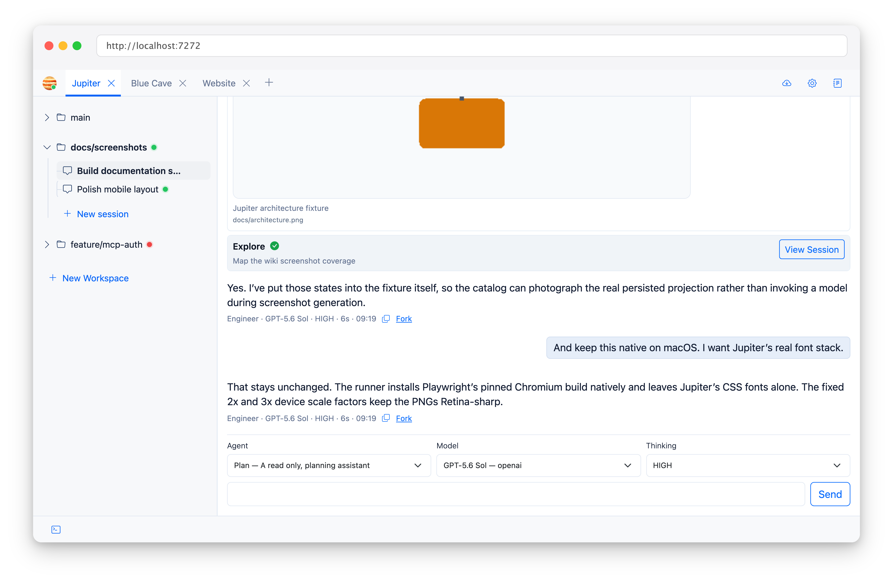

Jupiter agents are Markdown files with YAML frontmatter. This is similar to other coding agents such as Claude or Codex.
Jupiter also discovers compatible home/workspace agents from `.jupiter/agents`, `.claude/agents`, and `.codex/agents`
(home definitions are lower precedence than workspace definitions; within a scope Codex < Claude < Jupiter). Claude
Markdown accepts comma-separated or YAML-list tools and Codex TOML supports native tables such as
`developer_instructions`, `model_reasoning_effort`, and `sandbox_mode`. Unsupported control fields are reported rather
than silently ignored. Claude custom agents and Codex roles/files default to the primary `agent` mode when `mode` is
omitted; explicit `mode: subagent` keeps them as subagents. Jupiter supports an explicit `mode: agent` or `mode:
subagent` extension in Claude Markdown and Codex Markdown/TOML (registered Codex roles may also set `mode`; conflicting
file and role values are rejected). Primary imports receive the bundled primary model fallback when model is omitted or
`inherit`, and may use `task`; subagents cannot use recursive task delegation. Agents omitting model or tools are marked
as inheriting those values; only subagent tools are intersected with the invoking agent's permissions.

## Primary Agents

Jupiter ships with two primary agents:

- **Plan** - focused on planning and exploration.
- **Engineer** - the coding agent.

Their current model preferences live in the bundled agent definitions and may change independently of this
documentation. See [Models and Providers](Models-and-Providers) for model selection and fallback behaviour.

There are also Explore, Apprentice, and Test subagents. See [Subagents](Subagents).

## Agent File Format

An agent definition can contain:

- `id` and `name`
- `description`
- `mode`: `agent` or `subagent`
- default `model` (a single model ID or a comma-separated, ordered preference list)
- `reasoningEffort`
- optional `textVerbosity`
- tool permissions
- a Markdown prompt body

## Tool Permissions

The tool map decides what an agent can call directly. `*` expands to native tools plus `mcp:*`; primary agents also get
the `task` tool.

One subtle point: Plan has no direct write or command tools, but it **can** delegate to configured subagents. Its
“planning only” behaviour is therefore partly prompt-directed, not a transitive read-only sandbox.

Subagents never receive `task`, so native delegation cannot recurse forever.

The composer lets you pick the agent, model, and thinking level for a turn. Without an explicit model or thinking
override, the selected agent's configured defaults apply.
