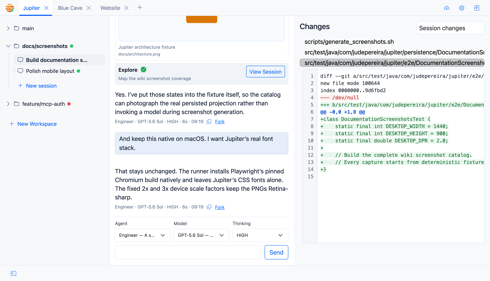

# Jupiter Documentation

Jupiter is a coding harness for remote development: run it where the code lives, then work from any browser.

## Start here

If this is your first run, go straight to [Getting Started](Getting-Started). After that, these are the pages that matter most:

- [Interface Tour](Interface-Tour) — what lives where in the UI.
- [Workspaces and Git Worktrees](Workspaces-and-Git-Worktrees) — the Git model Jupiter is built around.
- [Agents](Agents) — primary agents, subagents, tools, and permissions.
- [Remote Deployment](Remote-Deployment) — how to expose Jupiter beyond localhost.
- [Security Model](Security-Model) — what Jupiter protects, and just as importantly, what it doesn’t.

## The basic model

A **project** points at an existing source repository. A **workspace** is a Git worktree on a branch. A **session** is a persisted coding conversation inside that workspace.

The server owns the state, so reloading the browser doesn’t wipe your chat, drafts, tool traces, review state, or project settings.

The UI gives you streaming chat, a real PTY terminal, diff review, MCP tools, slash commands, and system notifications on one screen.

## Where should Jupiter run?

Ideally, on the machine that already has your source code: a workstation, home server, development VM, or remote box.

For remote access, a private VPN is recommended. If you need public access, use HTTPS and enable Jupiter’s Basic-auth gate.

The sidebar has the full topic list. [Feature Inventory](Feature-Inventory) is the complete v1 checklist.
