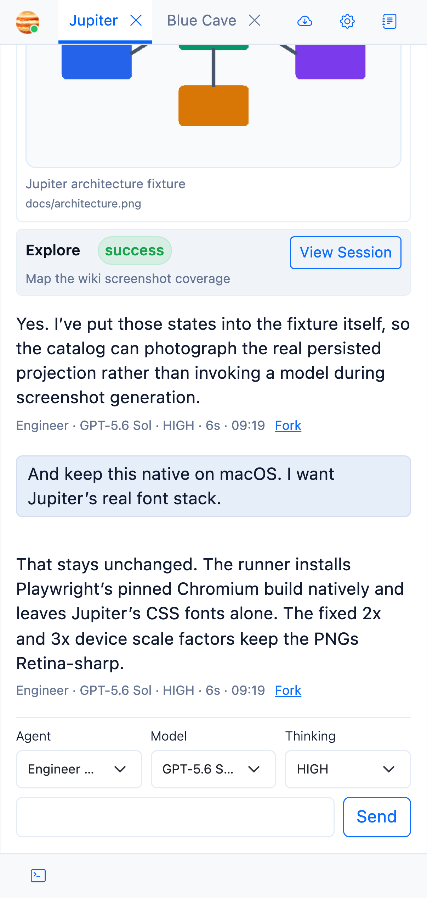

# Interface Tour

I’ve tried to keep the normal development loop on one screen: project, workspace, chat, review, terminal.

## Project bar

Projects sit across the top. Switching projects keeps you inside the same browser shell.

## Workspace and session rail

The left rail contains Git workspaces and their sessions. It also shows unread, running, and failed activity.

On smaller screens this turns into the mobile navigation rail rather than squeezing the desktop layout into oblivion.

## Chat

The centre panel streams assistant text and tool activity. The composer is also where you choose the agent, model, and thinking level for the next turn.

## Review

The review panel can show either files attributed to the current session or the workspace’s current Git changes.

## Terminal

The bottom panel contains one or more real PTY terminals for the active workspace.

## Settings and notifications

Project environment, MCP servers, lifecycle hooks, Git updates, usage, and OpenAI connection settings all live in **Settings**.

Warnings and errors appear as system balloons, so failures don’t disappear into server logs unless they really have to.
