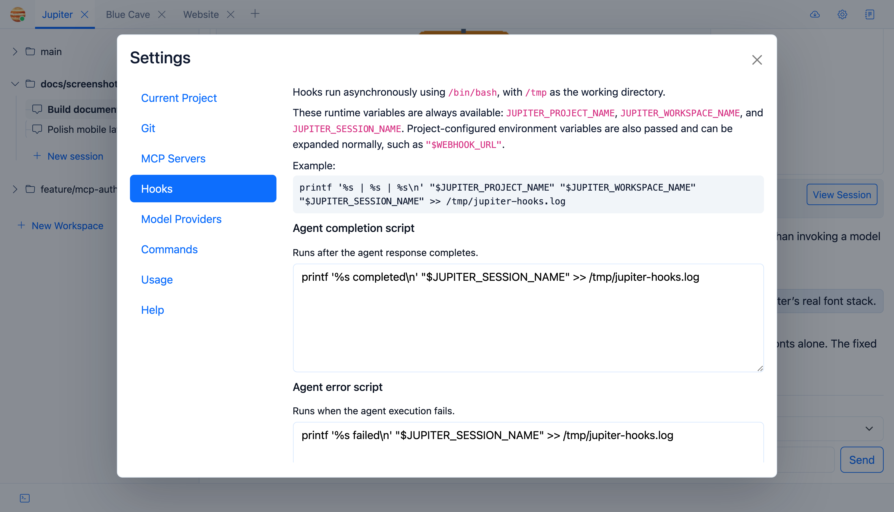

Lifecycle hooks are shell scripts Jupiter runs after selected agent events. They’re useful for notifications,
local automation, cleanup, and similar jobs.



## Available events

Jupiter has hooks for:

- agent completed
- agent errored
- subagent completed

Each event has its own script.

## Environment

Hooks receive project environment variables plus:

```text
JUPITER_PROJECT_NAME
JUPITER_WORKSPACE_NAME
JUPITER_SESSION_NAME
```

They do not automatically inherit Jupiter’s HTTP-authentication credentials or encryption key.

## Timeouts and failures

Hooks have a configurable timeout. A non-zero exit, timeout, or launch failure produces a system error balloon.

A completion hook runs after the agent turn has already completed, so a hook failure does not roll back that turn.
