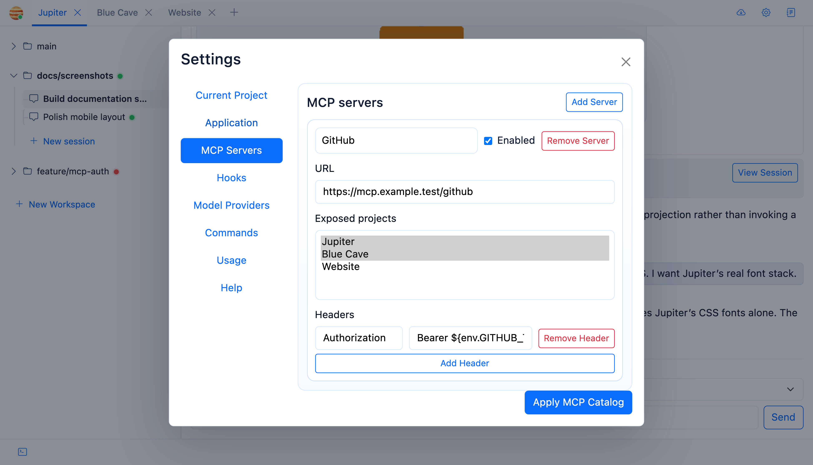

# MCP Servers

Jupiter can attach remote MCP servers and expose their tools only to the projects you choose.



## Server catalogue

Each entry has:

- a name
- URL
- enabled state
- request headers
- the projects allowed to use it

The catalogue is global; exposure is project-specific.

## Environment placeholders

URLs and header values can contain placeholders like this:

```text
${env.VARIABLE_NAME}
```

Jupiter checks project environment variables first, then the Jupiter process environment.

Missing values fail resolution. Resolved URLs and headers are also rejected if they contain line breaks.

## Runtime behaviour

Enabled servers connect for exposed projects. Changing the configuration reloads affected project runtimes.

Connection failures surface as system balloons, and Jupiter refreshes tools when a server announces that its tool set changed.

## Tool-name collisions

MCP tools join the agent registry dynamically when `mcp:*` is allowed.

If two connected servers produce the same effective tool name, Jupiter fails the collision instead of silently picking whichever happened to connect first.

For secrets, I’d use project environment variables with `${env.*}` placeholders rather than hard-coding tokens into URLs.
