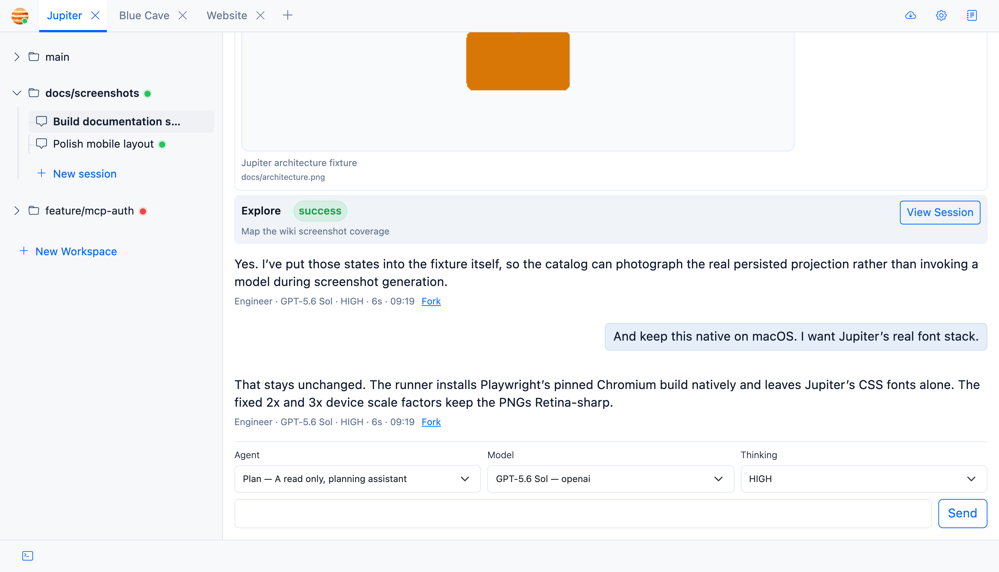

# Models and Thinking

Agent and model are deliberately separate choices in Jupiter. An agent defines behaviour and tools; the model is what runs the turn.

## Model catalogue

v1 loads model metadata from the configured models.dev catalogue and keeps the OpenAI GPT-5-family entries.

Where available, Jupiter keeps the display name, context limit, output limit, reasoning support, tool-call support, and release date.

The hardcoded fallback model ID is `openai/gpt-5.5`.

## Agent defaults

Bundled agents come with a preferred model and reasoning level, but the composer lets you override both for a primary turn.

## Thinking level

The selected thinking level is stored with the assistant message and passed into model requests that support it.

When you return to a session, Jupiter tries to restore the most recent assistant selection. If that model has disappeared from the catalogue, it falls back instead of leaving the UI in a broken state.

## Provider scope

The harness has provider abstractions, but v1’s user-facing model discovery is OpenAI GPT-5-family only. I’d rather document what exists than claim provider support that isn’t exposed yet.
