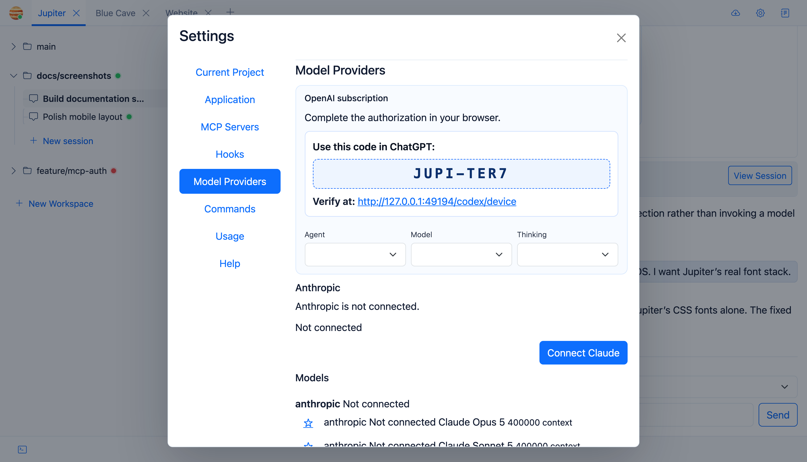

# OpenAI Authentication

Jupiter has two ways to authenticate with OpenAI: a normal API key, or the browser/device authorisation flow.

## API key

Set:

```bash
OPENAI_API_KEY=...
```

The equivalent Spring property is `openai.api-key`.

## Browser authorisation

Open **Settings → Model Providers** and start the OpenAI connection flow.



Jupiter shows a user code and verification URL, then polls until the authorisation finishes.

The resulting access, refresh, and ID tokens are stored in encrypted database fields. **Disconnect** clears that
persisted OAuth state. The encrypted connection is restored after a restart; an expired access token is refreshed when
possible.

## Which credential wins?

If a connected device-flow access token is present, Jupiter uses it with the ChatGPT Codex backend. Otherwise it uses
`openai.api-key` / `OPENAI_API_KEY` and the OpenAI API endpoint.

OpenAI is available when either the subscription OAuth connection or a configured API key is usable. Disconnecting the
subscription therefore does not make OpenAI unavailable when an API key is configured; the API-key path remains
available. When connected, Settings provides an OpenAI model multi-select; its selections persist across disconnect and
reconnect and filter additional chat choices. Models named by connected agent frontmatter remain available regardless of
that selection. See [Models and Thinking](Models-and-Thinking) for initialization, eligibility, and strict selections.

## Treat both as secrets

Settings refreshes model/provider statuses immediately after OpenAI authentication and disconnect actions. An API key is
obviously a secret; the device-flow tokens are too. Protect the Jupiter host, database, and encryption key accordingly.
