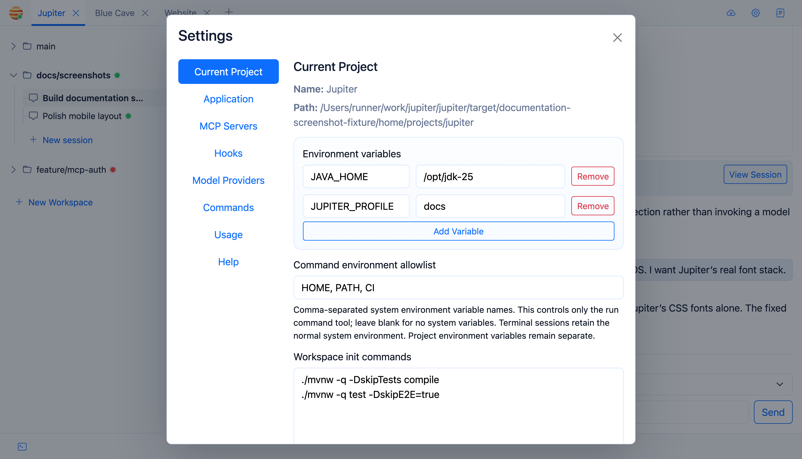

Project settings define how a repository should behave once a workspace is created.



## Workspace Initialization

Use workspace-init commands for setup that should happen on every fresh worktree, such as warming dependencies or
generating files.

For example:

```bash
./mvnw -q dependency:go-offline
npm install
```

After creating a workspace, Jupiter opens a visible terminal named **Workspace Init** and runs the configured commands
inside the new worktree. Project environment variables are available there, and the output remains visible in the
terminal tab for debugging.

## Project Environment Variables

Add environment names and values that should be available to project processes.

Project variables are available to terminals, agent commands, MCP configuration, and lifecycle hooks where applicable.

**Important:** Do not add sensitive values here! Set those values as the Docker environment variables, and use
`${env.VAR_NAME}` here.

## Host Variables Available to Agents

Agent `run_command` does not inherit the entire Jupiter host environment.

List the host variables an agent may receive, such as `PATH`. Jupiter copies only those variables before overlaying the
project variables.

The integrated terminal intentionally receives the broader Jupiter process environment before project variables are
overlaid. Jupiter's encryption key is never restored into the terminal.

## Lifecycle Hooks

Hooks receive project variables plus `JUPITER_PROJECT_NAME`, `JUPITER_WORKSPACE_NAME`, and `JUPITER_SESSION_NAME`. They
do not automatically inherit Jupiter's HTTP-authentication credentials or encryption key.

## MCP Placeholders

MCP URLs and headers can use `${env.NAME}` placeholders. Project variables take precedence over host/runtime values. The
encryption key is never available as an MCP placeholder.

## Other Settings

The Settings UI also contains MCP servers, provider connections, lifecycle hooks, automatic Git updates, and usage
views.
