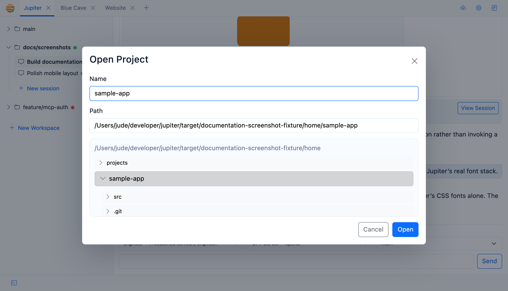

# Projects

A project simply points Jupiter at an existing source directory. Jupiter doesn’t clone or invent a repository for you here.

## Adding one

Use **New project**, browse the server filesystem, and select the directory you want.

Jupiter stores the project name and normalized path. Closing a project removes it from the visible project bar; it does **not** delete the source directory.

If you later add a path Jupiter has seen before, it can reopen the persisted project state.

## Project-specific settings

Each project can carry:

- workspace initialization commands
- project environment variables
- the host-environment allowlist used by agent commands
- MCP exposure settings

See [Project Settings](Project-Settings).

## Where the actual work happens

Jupiter does its branch work in [Git worktrees](Workspaces-and-Git-Worktrees). That keeps separate branches in separate directories instead of constantly switching one checkout back and forth.
