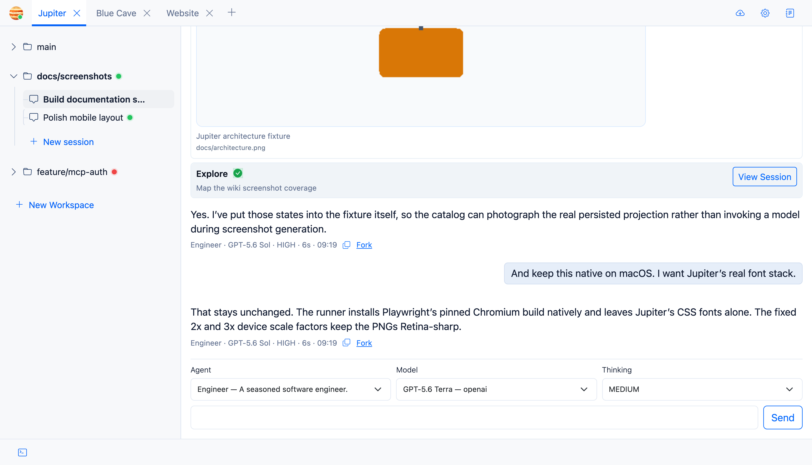
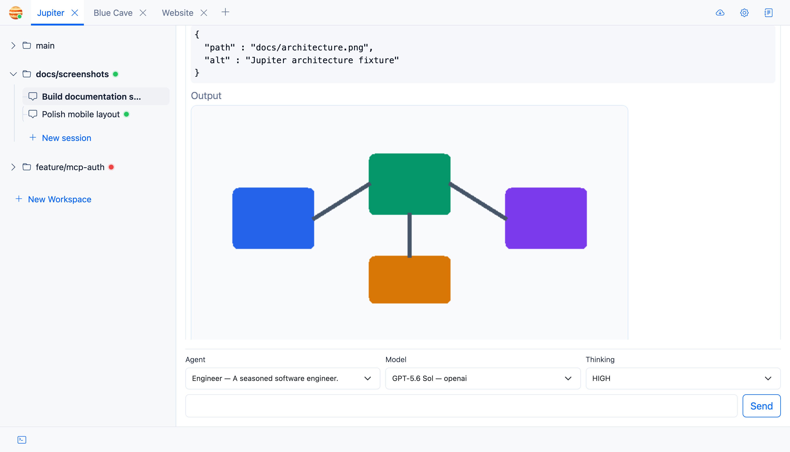

A session is a conversation inside one workspace.

## More than one session

You can create several sessions for the same workspace and switch between them from the left navigation. It's important
to note that they share the same filesystem view of the workspace. Typical usages involve using different sessions to
plan, but one session to manage all active agent work.

## Stopping a turn

The stop button cancels the active assistant turn and any managed command execution attached to it.

## Drafts

Unsent composer text is saved per session, which means you can navigate elsewhere without losing half-written prompts.

## Forking

A completed primary assistant message can be forked into a new primary session from that point in the conversation.

Subagent conversations are inspectable too, but they don’t expose the primary-session fork action.

## Tool activity and images

Tool starts, progress, and results remain visible in chat and are persisted with the session.

A `task` call links to its subagent session so you can inspect delegated work directly. Agents can also display PNG,
JPEG, GIF, and WebP workspace images inline in chat.

## Context compaction

Long-running sessions can eventually approach a model’s context limit. Jupiter automatically summarizes older completed
turns while keeping recent work intact. The summary appears as a visible system message.
