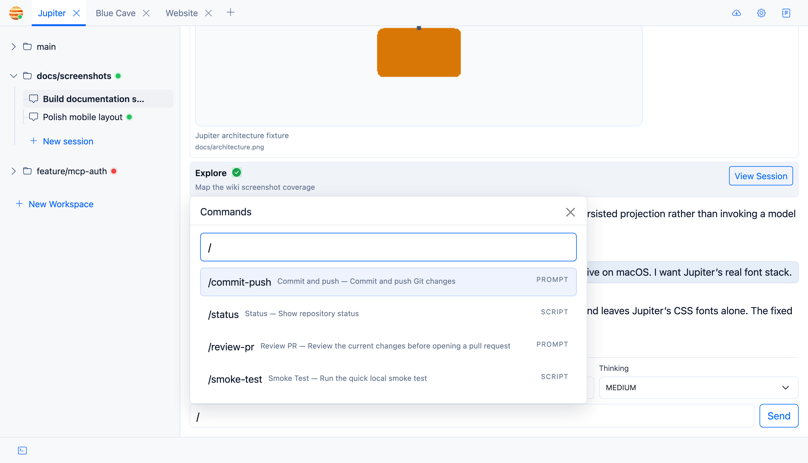

Slash commands are Markdown files with YAML frontmatter. Some interoperability between Claude Code and Codex is
available. If there's a feature that you'd like to add, please create an issue for it.



## Where Commands Come From

Jupiter loads self-bundled commands, along with user commands from:

```text
~/.jupiter/commands/*.md
```

## Two Command Types

**Prompt** commands put their body into the composer. You can review or edit it before sending.

**Script** commands run immediately and stream the result into chat.

### Example

```markdown
---
id: status
name: Status
type: script
description: Show repository status
workingDir: .
timeoutSeconds: 30
---
git status --short
```

`type` is required and must be `prompt` or `script`. `workingDir` and `timeoutSeconds` are script-only options.

## UI

Slash commands may also be added from the Settings. Go to **Settings → Commands** to view, edit, and add new commands.

## Bundled Commands

Bundled commands include:

- `/status` - runs `git status --short`.
- `/commit-push` - inserts a prompt asking the agent to commit and push the current changes.

Command IDs must be unique across bundled and user commands.
