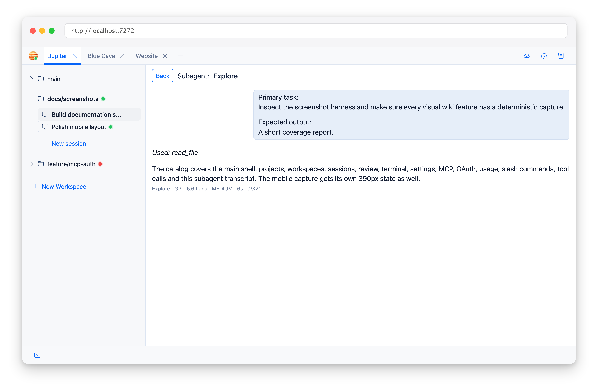

# Subagents

Subagents are how Jupiter delegates focused work without turning that work into a black box.

## What ships with v1?

- **Explore** — read-only codebase exploration; prefers GPT-5.6 Luna, then Claude Sonnet 5.
- **Apprentice** — implementation work; prefers GPT-5.6 Luna, then Claude Sonnet 5.
- **Test** — testing-focused work; prefers GPT-5.6 Luna, then Claude Sonnet 5.

These ordered preferences use the first available provider before the request. A failed model/API request is not retried
with the next preference. Explicit user model selections remain strict; when a default falls back, the child session and
generated message retain the preferred model and show the actual model used.

## A task is a real child session

When a primary agent calls `task`, Jupiter creates a persisted child session linked to the parent session, parent tool
call, and selected subagent.

That child session stores its own messages and tool traces. You can open it from the parent task call and inspect what
it actually did.

## Changed files bubble up

If a subagent writes or patches files successfully, Jupiter records those changes in both the child and parent session.

This matters: delegating implementation shouldn’t make the parent review panel mysteriously incomplete.

## No recursive delegation

Subagents cannot receive Jupiter’s built-in `task` tool, so one subagent cannot spawn another through the native task
mechanism.

## Hooks

The **subagent completed** lifecycle hook runs after a non-cancelled subagent finishes, including error completion. See
[Lifecycle Hooks](Lifecycle-Hooks).
