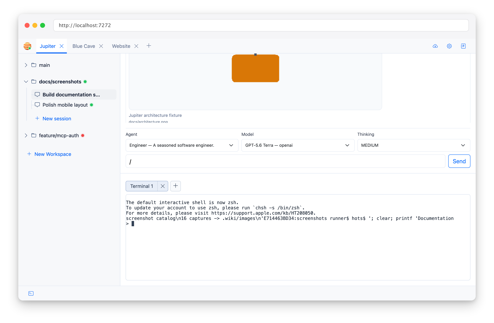

The terminal in Jupiter is a real PTY, not a textarea pretending to be one.

## Shell

Jupiter starts `$SHELL`, falling back to `/bin/bash`, as a login shell.

It starts in the active workspace directory.

## Tabs

Each workspace can have multiple terminal tabs. You can create, switch, and close them independently.

## Reconnecting

A running terminal stays on the server when the browser disconnects. Reconnecting reattaches to it and replays recent
output so you can continue where you left off.

This is handy when switching between two devices :)

## Environment

The terminal inherits the Jupiter process environment, then overlays project environment variables.

It can receive bootstrap runtime variables, including HTTP-authentication credentials, but never the encryption key.
This is intentionally broader than the environment given to agent `run_command`, because the terminal is directly
controlled by the authenticated user.

See [Project Settings](Project-Settings) for project variables and agent environment allowlisting.
