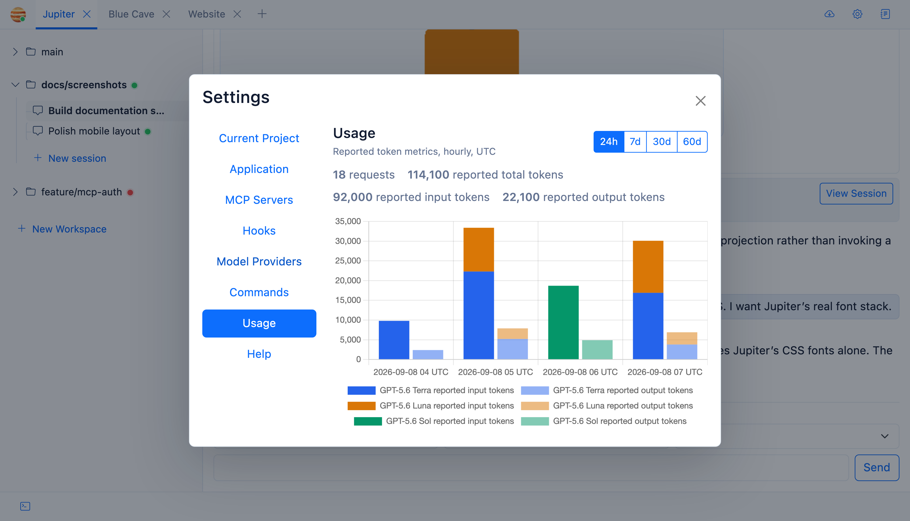

# Usage and Token Tracking

Jupiter keeps local token-usage history so you can answer a fairly basic question: which projects and models are actually consuming the tokens?

## Time ranges

The usage view supports:

- 24 hours
- 7 days
- 30 days
- 60 days

Hourly usage is grouped by project and model.

## What gets recorded?

When the provider returns the data, Jupiter stores input, output, total, cached-input, cache-write, and reasoning token counts.

It also keeps the operation type, model identifiers, finish information, and selected provider metadata.

Normal agent turns and context-compaction requests have different operation values, which makes compaction overhead visible rather than burying it in everything else.

## Retention

Usage facts and hourly rows older than 60 days are purged at startup and every six hours.

The cutoff hour is rebuilt so the still-valid part of that hour isn’t thrown away.

## Is this billing data?

No. This is Jupiter’s local accounting based on provider response metadata, not an OpenAI invoice.
