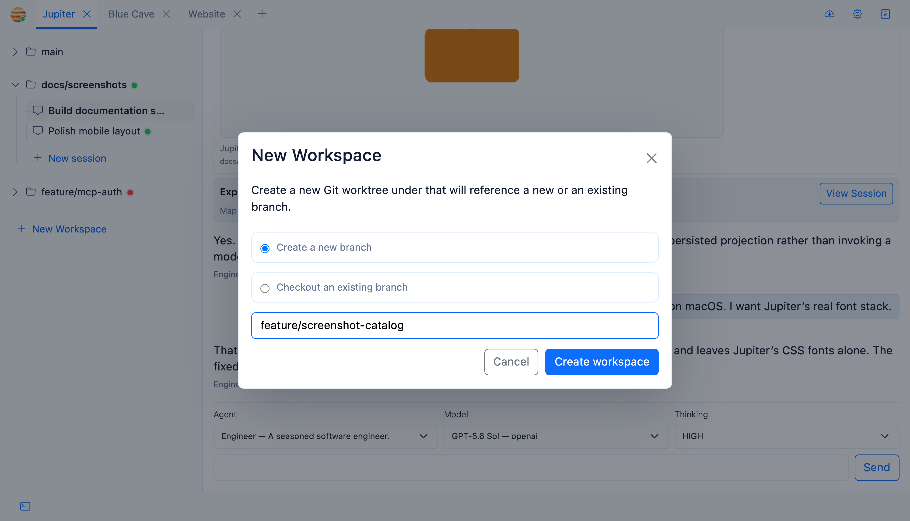

# Workspaces and Git Worktrees

A Jupiter workspace is a Git worktree backed by a branch. This is one of the core design choices in Jupiter.

## Creating a workspace

You get two modes:

- **Create branch** — make a new branch and worktree.
- **Checkout existing branch** — create a worktree for a branch that already exists.

Git does the real validation underneath; branch and checkout failures are surfaced in the UI.

## Why worktrees?

Because switching one checkout between several bits of agent work gets old very quickly.

Worktrees let multiple workspaces progress on separate branches at the same time. Every session inside one workspace shares that worktree’s filesystem state.

## Initialisation

If the project has workspace-init commands, Jupiter opens a terminal named **Workspace Init** and runs them after creating the worktree.

See [Workspace Initialization](Workspace-Initialization).

## Closing a workspace

Before removing a workspace, Jupiter checks for uncommitted changes and unpushed commits. If either exists, you’ll get a confirmation before forced worktree removal.

So, closing a workspace is quite different from closing a chat session: the workspace owns a real Git worktree.

## Pulling changes

You can pull manually, or enable automatic fast-forward-only updates. See [Git Updates](Git-Updates).
