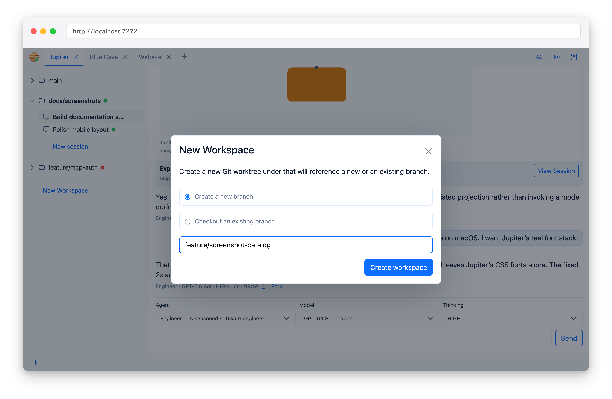

A Jupiter workspace is a Git worktree backed by a branch. This is one of the core design choices in Jupiter.



## Creating a Workspace

You get two modes:

- **Create a nwe branch** - create a new branch and a corresponding worktree for it.
- **Checkout an existing branch** - create a worktree for a branch that already exists.

Worktrees let multiple agents progress on separate branches at the same time. Every session inside a workspace shares
that worktree’s filesystem state.

## Initialisation

If the project has workspace-init commands, Jupiter opens a terminal named **Workspace Init** and runs them after
creating the worktree.

See [Project Settings](Project-Settings) for configuration and examples.

## Closing a Workspace

Before removing a workspace, Jupiter checks for uncommitted changes and unpushed commits. If either exists, you’ll get a
confirmation before forced worktree removal.

## Pulling Changes

You can pull manually, or enable automatic fast-forward-only updates. See [Git Updates](Git-Updates). This is
recommended for the main branch checked out in the default workspace, so that new branches begin their life with the
most up-to-date version of main/master/develop.

## Automatic commit attribution

Ordinary `git commit` commands through `/usr/bin/git` in the Jupiter container append this trailer:

```text
Co-authored-by: Jupiter IDE <340693705+jupiter-ide@users.noreply.github.com>
```

This applies to agent and terminal commands. It does not change the author or committer, or alter existing hooks. Git's
native `addIfDifferent` deduplication checks the final trailer block, not arbitrary occurrences in the message body.

The wrapper does not apply when invoking the real Git binary or helpers directly, using a Git alias/internal operation,
or running Git outside the container. Merge, cherry-pick, and rebase operations do not become attributed just because
they may create commits internally. `--fixup` modes can rewrite commit messages and omit the trailer.
